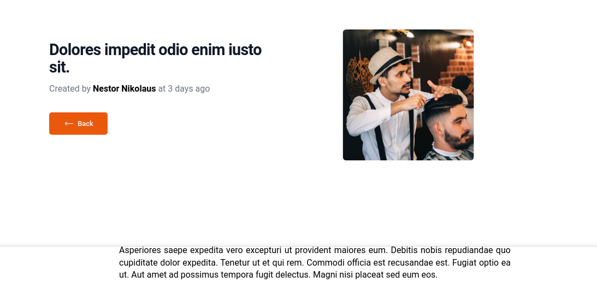

<h1 align="center"> Blog </h1>

  Um blog com feito com Laravel, é possível nele
  criar posts, adicionar comentários a um post e por aí vai. Minha primeira vez trabalhando com o Vite.

<a href="#orientacoes"> Orientações |</a>

<a href="#tecnologias"> Tecnologias | </a>

<a href="#desafios"> Desafios |</a>

<a href="#tecnologias"> Licença </a>

  

## Orientações

<ul>
  <li> Para rodar em sua máquina certifique-se de ter o composer e o npm instalador em sua máquina. </li>
  <li> Com o composer instale as depedencias necessárias para o projeto com composer install.</li>
  <li> Com o npm instale as depedências necessárias para o projeto com npm install ou npm i. </li>
  <li> Execute o comando 'php artisan serve' em seu terminal e também o comando 'npm run dev' para executar o vite que é utilizado para trabalhar com CSS e JS. A porta de acesso é o localhost:8000 </li>
</ul>

## Tecnologias

<ul>

<h5 align="center" id="tecnologias"> Foram utilizadas as seguintes tecnologias: </h5>

<li> HTML e CSS (Tailwind.css); </li>
<li> Javascript E NPM; </li>
<li> Laravel; </li>
<li> Vite. </li>

</ul>

## Desafios enfrentados

 Este projeto me desafiou muito, principalmente a trabalhar com Laravel, pois percebi que há muito a se aprender sobre esse framework. Tive dificuldades em trabalhar com relacionamentos entre tabelas, sendo a minha primeira vez aplicando esse conceito com Laravel e também aprendi técnicas que melhoraram meu código. 

## Licença

 O projeto está sob a licença MIT. 

